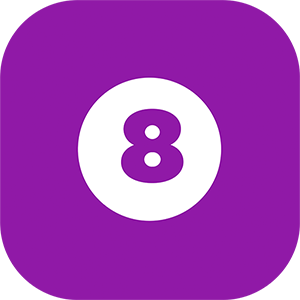
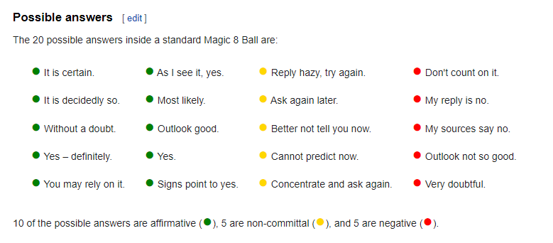
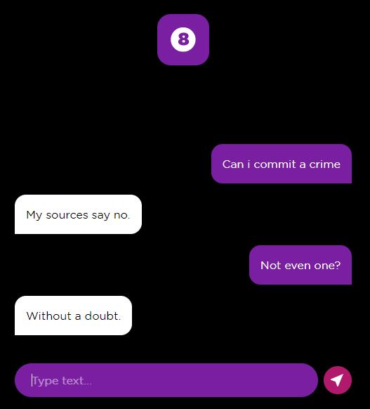

  

<h1 align="center">Smart 8</h1>

### Why?

The main objective of the project was to acquire basic knowledge of Machine Learning, Node.js, React and React Native development, and as they should be really basic, I focused only on what they would actually complete.

### What is

Smart 8 was developed as a system to use machine learning to answer yes or no questions, just like the famous magic 8 balls, but in a slightly more intelligent way, avoiding different answers, for equal questions.

the answers must be classified as a magic 8 ball, and for that purpose the graph found on wikipedia was used:

  

### What was needed

*The project needed two main factors:*

- Two front-end that can receive and send messages to the server, one mobile and one for the web.

- A system that receives the messages and classifies them as, `affirmative`,` negative`, or `non-committal`, and soon after, returns to the front end with the answer.

- Finally, the front end created a random response according to the information coming from the server and will show the user

### What was used?

*As main tools, were used:*

- [Google Cloud Funcions](https://cloud.google.com/functions) for the backend
- [Google Cloud Natural Language](https://cloud.google.com/natural-language) to process and sort responses
- [React](https://pt-br.reactjs.org/) to the web front end
- [Expo](https://expo.io/) to the mobile front end
- [Axios](https://github.com/axios/axios) to HTTP requests

### Where is the project?

The project is currently in [smart8.app](https://smart8.app/) and on [Google Play Store](https://play.google.com/store/apps/details?id=br.com.smart8.app)

  

### What was missing

*There are some possible improvements and resolutions that can be implemented*

- [ ] Improve layout and add more animations, to make the user experience better
- [ ] Add a longer message history
- [ ] Use a better AI system, or use more questions and leave training for longer ( Need money )